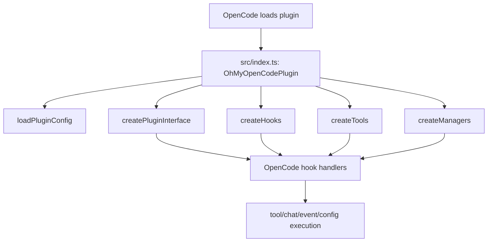
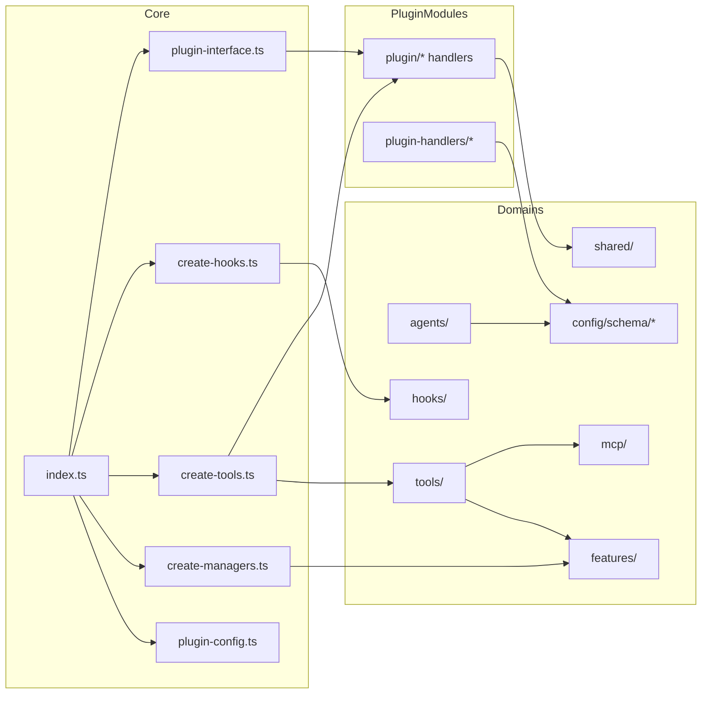
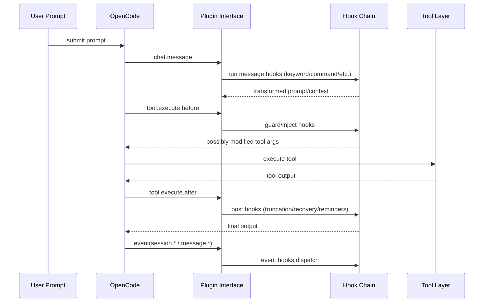
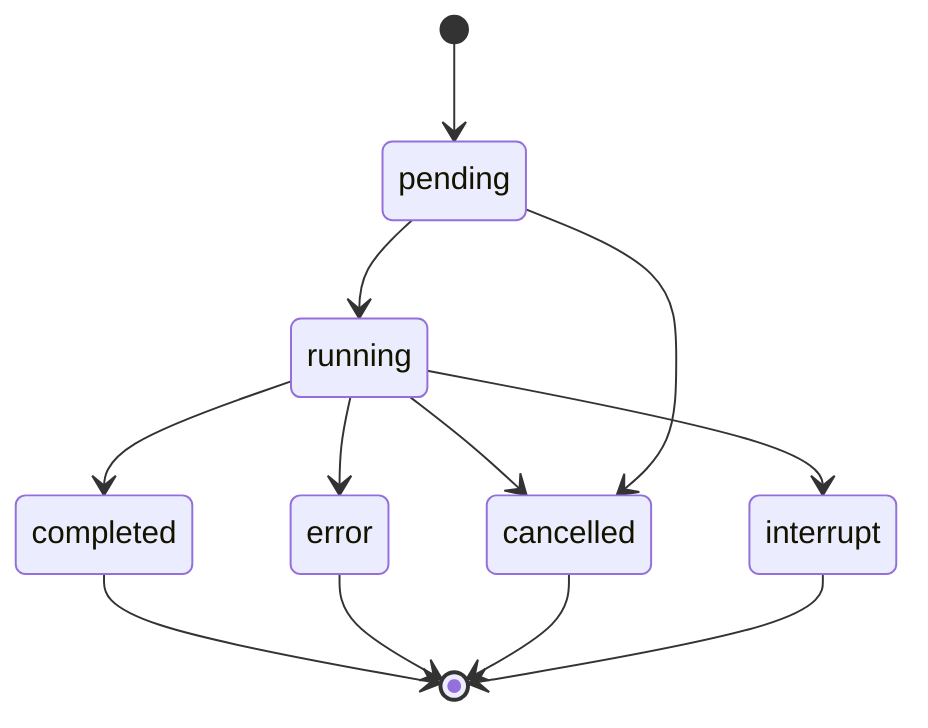
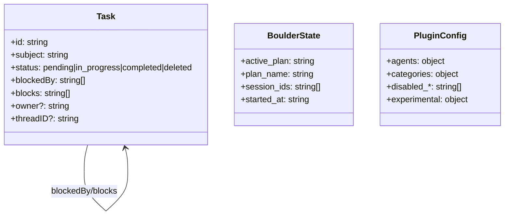

# SYSTEM_WIKI — Oh My OpenCode

> **Generated from repository source and docs on 2026-02-16**
> 
> Scope: `oh-my-opencode` (OpenCode plugin + CLI), not a standalone web backend service.

---

## Table of Contents

- [1. System Overview](#1-system-overview)
  - [1.1 Project Introduction and Background](#11-project-introduction-and-background)
  - [1.2 Core Features](#12-core-features)
  - [1.3 Architecture at a Glance](#13-architecture-at-a-glance)
  - [1.4 Technology Stack Summary](#14-technology-stack-summary)
  - [1.5 Project Directory Structure](#15-project-directory-structure)
- [2. Architecture Design](#2-architecture-design)
  - [2.1 Architecture Pattern](#21-architecture-pattern)
  - [2.2 System Architecture Diagram](#22-system-architecture-diagram)
  - [2.3 Component Relationship Diagram](#23-component-relationship-diagram)
  - [2.4 Key Sequence Diagram](#24-key-sequence-diagram)
  - [2.5 Key State Machine Diagram](#25-key-state-machine-diagram)
- [3. Technology Stack Details](#3-technology-stack-details)
  - [3.1 Languages and Build](#31-languages-and-build)
  - [3.2 Frameworks and Dependencies](#32-frameworks-and-dependencies)
  - [3.3 Database Technologies](#33-database-technologies)
  - [3.4 Middleware/Runtime Components](#34-middlewareruntime-components)
  - [3.5 Third-Party Integrations](#35-third-party-integrations)
- [4. Modules & Components](#4-modules--components)
  - [4.1 Module Responsibilities](#41-module-responsibilities)
  - [4.2 Core Interfaces and Extension Points](#42-core-interfaces-and-extension-points)
  - [4.3 Key Business/Execution Flows](#43-key-businessexecution-flows)
- [5. Data Design](#5-data-design)
  - [5.1 Database Design](#51-database-design)
  - [5.2 File-Based Data Model](#52-file-based-data-model)
  - [5.3 Cache Strategy](#53-cache-strategy)
- [6. API Documentation](#6-api-documentation)
  - [6.1 HTTP API](#61-http-api)
  - [6.2 OpenCode Plugin Hook API (Consumed/Implemented)](#62-opencode-plugin-hook-api-consumedimplemented)
  - [6.3 Internal Tool Interface Inventory](#63-internal-tool-interface-inventory)
  - [6.4 CLI Command Interface](#64-cli-command-interface)
  - [6.5 Error Model / Status Codes](#65-error-model--status-codes)
- [7. Configuration Management](#7-configuration-management)
  - [7.1 Environment and Config Resolution](#71-environment-and-config-resolution)
  - [7.2 Config Structure and Merge Semantics](#72-config-structure-and-merge-semantics)
  - [7.3 Schema Management](#73-schema-management)
- [8. Development Guide](#8-development-guide)
  - [8.1 Prerequisites](#81-prerequisites)
  - [8.2 Build/Test/Typecheck Commands](#82-buildtesttypecheck-commands)
  - [8.3 Coding Standards](#83-coding-standards)
  - [8.4 Testing Strategy](#84-testing-strategy)
  - [8.5 Release and PR Workflow](#85-release-and-pr-workflow)
- [References](#references)

---

## 1. System Overview

### 1.1 Project Introduction and Background

**Oh My OpenCode** is an OpenCode plugin that provides a batteries-included agent harness with:

- multi-agent orchestration,
- lifecycle hook automation,
- tool augmentation (LSP/AST/search/delegation/session tools),
- Claude Code compatibility layers,
- and a supporting CLI.

It is designed to improve reliability and productivity of autonomous coding workflows in terminal-first environments.

### 1.2 Core Features

- Plugin-based orchestration of specialized agents (e.g., Sisyphus, Hephaestus, oracle, librarian, explore).
- Extensive hook system for pre/post tool execution, prompt transforms, session events, compaction handling.
- Delegation system with categories and skill loading.
- Built-in MCP integration (`websearch`, `context7`, `grep_app`) plus Claude-compatible and skill-embedded MCP loading.
- File-based task/state persistence (task system and boulder continuation state).
- CLI utilities: install, run, doctor, version checking, MCP OAuth login/logout/status.

### 1.3 Architecture at a Glance

At runtime, the plugin entry (`src/index.ts`) composes:

1. config,
2. managers,
3. tools,
4. hooks,
5. plugin interface handlers,

then returns OpenCode hook implementations plus `experimental.session.compacting` customization.

### 1.4 Technology Stack Summary

| Area | Stack |
|---|---|
| Language | TypeScript (strict), JavaScript |
| Runtime / Package Manager | Bun |
| Build | `bun build` + `tsc --emitDeclarationOnly` |
| Plugin SDK | `@opencode-ai/plugin`, `@opencode-ai/sdk` |
| Validation | `zod` |
| Search/Refactor | LSP + AST-Grep |
| Config format | JSON + JSONC |
| CLI | `commander`, `@clack/prompts` |
| MCP | Context7, Exa/Tavily websearch, grep.app |

### 1.5 Project Directory Structure

```text
oh-my-opencode/
├── src/
│   ├── index.ts
│   ├── create-hooks.ts
│   ├── create-managers.ts
│   ├── create-tools.ts
│   ├── plugin-interface.ts
│   ├── plugin-config.ts
│   ├── agents/
│   ├── hooks/
│   ├── tools/
│   ├── features/
│   ├── mcp/
│   ├── config/
│   ├── plugin-handlers/
│   ├── plugin/
│   └── shared/
├── docs/
├── script/
├── packages/
└── dist/
```

---

## 2. Architecture Design

### 2.1 Architecture Pattern

The system follows a **plugin-composition + modular layered architecture**:

- **Entry orchestration layer**: wires all subsystems.
- **Configuration orchestration layer**: resolves, validates, and merges runtime configuration.
- **Manager layer**: background tasks, tmux session handling, skill MCP lifecycle.
- **Tool layer**: concrete capabilities exposed to agents.
- **Hook layer**: cross-cutting behavior at lifecycle boundaries.
- **Feature layer**: persistent/task/compatibility/runtime support modules.

### 2.2 System Architecture Diagram



### 2.3 Component Relationship Diagram



### 2.4 Key Sequence Diagram



### 2.5 Key State Machine Diagram

Background task lifecycle (from background-agent module):



---

## 3. Technology Stack Details

### 3.1 Languages and Build

- **TypeScript** with `strict: true` (`tsconfig.json`).
- **Bun** as runtime and package manager.
- Build pipeline:
  - bundle plugin and CLI with Bun,
  - emit declaration files with TypeScript,
  - generate JSON schema artifact.

### 3.2 Frameworks and Dependencies

Key dependencies (non-exhaustive):

| Dependency | Purpose |
|---|---|
| `@opencode-ai/plugin` | Plugin type/contracts and tool helper |
| `@opencode-ai/sdk` | OpenCode client API access |
| `zod` | configuration schema validation |
| `@ast-grep/cli`, `@ast-grep/napi` | AST-aware code search/replace |
| `commander` | CLI command framework |
| `@clack/prompts` | interactive CLI/TUI prompts |
| `jsonc-parser` | JSONC parsing support |
| `@modelcontextprotocol/sdk` | MCP protocol integration |

### 3.3 Database Technologies

**N/A for a project-owned relational/NoSQL database.**

This repository does not define its own DB schema/migrations. It primarily operates as:

- a plugin runtime,
- file-based state/task persistence,
- and OpenCode SDK-backed state access.

### 3.4 Middleware/Runtime Components

- **Hook middleware chain** for chat/tool/event interception.
- **Background task manager** with queue/concurrency control.
- **Skill MCP manager** for per-session MCP lifecycle.
- **Tmux session manager** for visual multi-agent pane orchestration.

### 3.5 Third-Party Integrations

- OpenCode plugin and SDK APIs.
- MCP servers:
  - `websearch` (Exa/Tavily configuration path),
  - `context7`,
  - `grep_app`.
- Claude compatibility loading paths for commands/skills/agents/MCP.

---

## 4. Modules & Components

### 4.1 Module Responsibilities

| Module | Responsibility | Key Files |
|---|---|---|
| `src/` root composition | plugin startup orchestration | `index.ts`, `create-*.ts`, `plugin-interface.ts`, `plugin-config.ts` |
| `agents/` | built-in agent definitions and prompt metadata | `agents/AGENTS.md`, `sisyphus.ts`, `hephaestus.ts`, `oracle.ts`, etc. |
| `hooks/` | lifecycle behavior injection/guarding/recovery | `hooks/AGENTS.md`, hook directories |
| `tools/` | tool implementations and factories | `tools/AGENTS.md`, `tools/index.ts` |
| `features/` | background tasking, skill loading, compat layers, state systems | `features/AGENTS.md` |
| `plugin/` | OpenCode hook handler implementations | `chat-message.ts`, `event.ts`, `tool-execute-before.ts`, etc. |
| `plugin-handlers/` | config transformation pipeline | `config-handler.ts`, `agent-config-handler.ts`, etc. |
| `config/` | Zod schema and config types | `config/schema/*` |
| `mcp/` | built-in MCP definitions | `mcp/index.ts`, `websearch.ts`, `context7.ts`, `grep-app.ts` |
| `shared/` | common cross-cutting utilities | `shared/AGENTS.md` |
| `cli/` | installer/runner/doctor/oauth utilities | `cli/AGENTS.md`, `cli-program.ts` |

### 4.2 Core Interfaces and Extension Points

#### Add a new hook

1. Create `src/hooks/<name>/index.ts`.
2. Add hook name to hook schema (`src/config/schema/hooks.ts`).
3. Register in one of:
   - `src/plugin/hooks/create-core-hooks.ts`
   - `src/plugin/hooks/create-continuation-hooks.ts`
   - `src/plugin/hooks/create-skill-hooks.ts`

#### Add a new tool

1. Create `src/tools/<name>/` with `index.ts`, `tools.ts`, `types.ts`, `constants.ts`.
2. Register in `src/plugin/tool-registry.ts`.

#### Add a new agent

1. Add `src/agents/<agent>.ts`.
2. Register in built-in agent source registry.
3. Update config schemas where required.

### 4.3 Key Business/Execution Flows

- Prompt flow: `chat.message` hooks -> possible command/mode injection -> model execution.
- Tool flow: `tool.execute.before` guards -> tool execution -> `tool.execute.after` post-processing.
- Session flow: `event` hook dispatch for `session.created/idle/error/deleted` and related lifecycle events.
- Plan/continuation flow: boulder state + continuation hooks + optional orchestration loops.

---

## 5. Data Design

### 5.1 Database Design

**N/A (no first-party DB schema in this repository).**

### 5.2 File-Based Data Model

The project uses file-based state in several domains:

| Data | Location | Notes |
|---|---|---|
| Plugin config | `.opencode/oh-my-opencode.json(c)` and `~/.config/opencode/oh-my-opencode.json(c)` | user + project merge |
| Task system files | default under OpenCode config tasks directory (or configured storage path) | `T-*.json`, lock + atomic write |
| Boulder plan state | `.sisyphus/boulder.json` | plan execution continuity |
| MCP OAuth token store | `~/.config/opencode/mcp-oauth.json` | token persistence for MCP OAuth |
| Claude compatibility artifacts | `~/.claude/...` and project `.claude/...` paths | optional compatibility loaders |

Entity relationship (conceptual):



### 5.3 Cache Strategy

- **In-memory model cache state** at plugin startup.
- **Skill discovery cache** keyed by provider context.
- **Background task runtime maps** for status, queue, and descendant relationships.
- **Context/output truncation** strategies to reduce context window pressure.

---

## 6. API Documentation

### 6.1 HTTP API

**N/A for first-party REST/GraphQL endpoints in this repository.**

This repository is an OpenCode plugin and CLI package, not an HTTP backend service.

### 6.2 OpenCode Plugin Hook API (Consumed/Implemented)

Implemented through `src/plugin-interface.ts` and `src/index.ts`:

| Hook Key | Purpose |
|---|---|
| `tool` | register tool definitions |
| `chat.params` | mutate model/provider parameters before chat execution |
| `chat.message` | intercept/augment user message and session-level message behavior |
| `experimental.chat.messages.transform` | transform message history |
| `config` | inject/modify OpenCode runtime config |
| `event` | handle session/message/tool/lifecycle events |
| `tool.execute.before` | pre-tool guard/mutation |
| `tool.execute.after` | post-tool processing |
| `experimental.session.compacting` | compaction context customization |

### 6.3 Internal Tool Interface Inventory

Documented tool groups:

| Group | Examples |
|---|---|
| LSP | `lsp_goto_definition`, `lsp_find_references`, `lsp_symbols`, `lsp_diagnostics`, `lsp_prepare_rename`, `lsp_rename` |
| AST/Search | `ast_grep_search`, `ast_grep_replace`, `grep`, `glob` |
| Delegation/Background | `task`, `background_output`, `background_cancel`, `call_omo_agent` |
| Session | `session_list`, `session_read`, `session_search`, `session_info` |
| Skills/Commands | `skill`, `skill_mcp`, `slashcommand` |
| Interactive/Media | `interactive_bash`, `look_at` |

### 6.4 CLI Command Interface

Primary CLI commands (see `src/cli/AGENTS.md` and `src/cli/cli-program.ts`):

- `install`
- `run`
- `doctor`
- `get-local-version`
- `mcp-oauth`

### 6.5 Error Model / Status Codes

There is no centralized numeric HTTP error-code table because there is no first-party HTTP API in this repo.

Main status patterns:

- background task statuses: `pending`, `running`, `completed`, `error`, `cancelled`, `interrupt`
- task system statuses: `pending`, `in_progress`, `completed`, `deleted`
- tool-level errors are surfaced as descriptive error text per tool implementation.

---

## 7. Configuration Management

### 7.1 Environment and Config Resolution

Config sources:

1. User-level config (`~/.config/opencode/oh-my-opencode.jsonc` preferred over `.json`).
2. Project-level config (`<project>/.opencode/oh-my-opencode.jsonc` preferred over `.json`).

Project config is merged on top of user config.

### 7.2 Config Structure and Merge Semantics

- Schema-first validation via Zod (`src/config/schema/*`).
- Partial-loading behavior exists: invalid sections can be skipped while valid parts continue.
- Merge behavior includes set-like merging for `disabled_*` arrays.

Minimal example:

```jsonc
{
  "$schema": "https://raw.githubusercontent.com/code-yeongyu/oh-my-opencode/master/assets/oh-my-opencode.schema.json",
  "agents": {
    "oracle": { "model": "openai/gpt-5.2" }
  },
  "categories": {
    "quick": { "model": "anthropic/claude-haiku-4-5" }
  },
  "disabled_hooks": ["startup-toast"]
}
```

### 7.3 Schema Management

- Schema source: `src/config/schema/*`.
- Regeneration command: `bun run build:schema`.
- Schema artifact path: `assets/oh-my-opencode.schema.json`.

---

## 8. Development Guide

### 8.1 Prerequisites

- Bun runtime/tooling.
- TypeScript compiler.
- OpenCode runtime environment for plugin execution.

### 8.2 Build/Test/Typecheck Commands

```bash
bun run typecheck
bun run build
bun test
bun run build:schema
```

Additional scripts:

```bash
bun run build:all
bun run build:binaries
```

### 8.3 Coding Standards

Project conventions include:

- Bun as primary package manager/build runner.
- Strong type safety (no `as any`, no `@ts-ignore` style suppression in normal changes).
- Modular architecture discipline (single responsibility per file, avoid catch-all helper dumps).
- Keep `index.ts` files focused on composition/entry concerns.

### 8.4 Testing Strategy

- TDD-oriented flow (RED -> GREEN -> REFACTOR) is recommended/enforced by project guidance.
- Co-located tests (`*.test.ts`) are extensively used across modules.
- Verify with typecheck + tests + build for production-quality changes.

### 8.5 Release and PR Workflow

- PR target branch policy: **feature branches -> `dev`**.
- `master` is production/published branch (no direct feature PR target).
- Publishing is intended through project release workflow/automation, not ad hoc local publish shortcuts.

---

## References

### Repository source references

- `src/index.ts`
- `src/create-managers.ts`
- `src/create-tools.ts`
- `src/create-hooks.ts`
- `src/plugin-interface.ts`
- `src/plugin-config.ts`
- `src/plugin/tool-registry.ts`
- `src/plugin/chat-message.ts`
- `src/plugin/chat-params.ts`
- `src/plugin/messages-transform.ts`
- `src/plugin/event.ts`
- `src/plugin/tool-execute-before.ts`
- `src/plugin/tool-execute-after.ts`
- `src/mcp/index.ts`, `src/mcp/websearch.ts`, `src/mcp/context7.ts`, `src/mcp/grep-app.ts`
- `src/features/claude-tasks/*`
- `src/features/boulder-state/*`
- `src/features/mcp-oauth/*`
- `package.json`
- `tsconfig.json`
- `script/build-schema.ts`

### Internal documentation references

- `AGENTS.md` (repo root)
- `src/AGENTS.md`
- `src/agents/AGENTS.md`
- `src/hooks/AGENTS.md`
- `src/tools/AGENTS.md`
- `src/features/AGENTS.md`
- `src/config/AGENTS.md`
- `src/mcp/AGENTS.md`
- `src/plugin-handlers/AGENTS.md`
- `src/cli/AGENTS.md`
- `docs/features.md`
- `docs/configurations.md`
- `docs/guide/overview.md`

### External references

- OpenCode plugins doc: <https://opencode.ai/docs/plugins/>
- OpenCode SDK doc: <https://opencode.ai/docs/sdk/>
